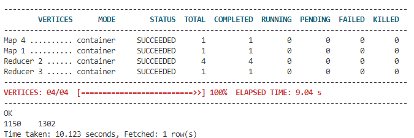

# 进入 hive CLI
hive

# 创建数据库
CREATE DATABASE chengwb;

# 创建表、导入数据

```sql
CREATE EXTERNAL TABLE t_movie(
     MovieID int,
     MovieName string,
     MovieType string
     )
     ROW FORMAT SERDE 'org.apache.hadoop.hive.contrib.serde2.MultiDelimitSerDe'
     WITH SERDEPROPERTIES ("field.delim"="::")
     location '/data/hive/movies.dat';

load data local INPATH  "movies.dat" into TABLE t_movie;

CREATE EXTERNAL TABLE t_user(
     UserID int,
     Sex string,
     Age int,
     Occupation int,
     Zipcode int
     )
     ROW FORMAT SERDE 'org.apache.hadoop.hive.contrib.serde2.MultiDelimitSerDe'
     WITH SERDEPROPERTIES ("field.delim"="::")
     location 'users.dat';

LOAD DATA LOCAL INPATH 'users.dat' INTO TABLE t_user;

CREATE EXTERNAL TABLE t_rating(
UserID int, 
MovieID int, 
Rate int, 
Times int
) 
ROW FORMAT SERDE 'org.apache.hadoop.hive.contrib.serde2.MultiDelimitSerDe'  
WITH SERDEPROPERTIES ("field.delim"="::") 
location '/data/hive/ratings.dat';


LOAD DATA LOCAL INPATH 'ratings.dat' INTO TABLE t_rating;
```

# 题目一
展示电影 ID 为 2116 这部电影各年龄段的平均影评分。

```sql
select u.age, avg(r.rate) from t_rating as r left join t_user as u on r.UserID=u.UserID where r.MovieID=2116 group by u.age order by u.age;
```


# 题目二
找出男性评分最高且评分次数超过 50 次的 10 部电影，展示电影名，平均影评分和评分次数。
```sql
select m.moviename, t_1.avgrate, t_1.total from (select r.movieid, avg(r.rate) as avgrate, count(r.rate) as total from t_rating as r inner join t_user as u on r.UserID=u.UserID where u.Sex='M' group by r.movieid) as t_1 inner join t_movie as m on t_1.movieid=m.movieid where t_1.total>50 order by t_1.avgrate desc limit 10;
```


# 题目三
找出影评次数最多的女士所给出最高分的 10 部电影的平均影评分，展示电影名和平均影评分（可使用多行 SQL）。

* 查出评分最多的女性
```sql
select r.userid, count(r.rate) as total from t_rating as r inner join t_user as u on r.userid=u.userid where u.sex='F' group by r.userid order by total desc limit 1;
```

* 查出其评分最高的 10 部电影的电影名和平均分。
```sql
select collect_set(m.moviename)[0], avg(r.rate) from t_rating as r left join t_movie as m on r.movieid=m.movieid where r.movieid in (select movieid from t_rating where userid=1150 order by rate desc limit 10) group by r.movieid;
```

